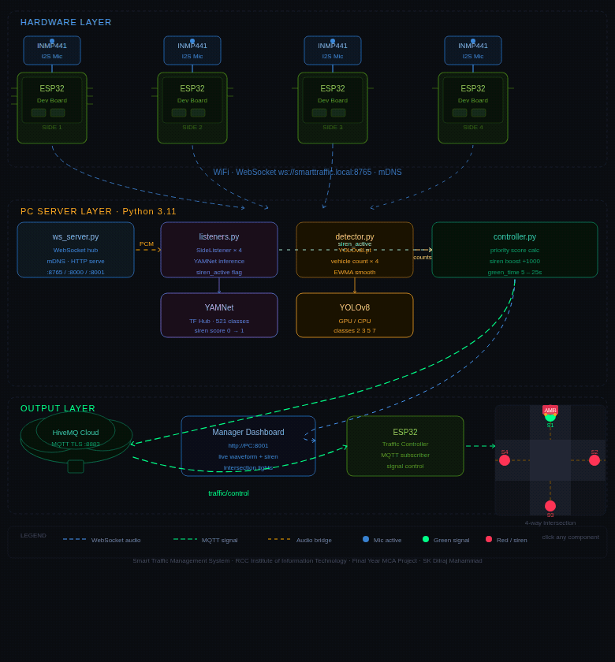

# 🚦 Smart Traffic System with Ambulance Siren Detection

A real-time, AI-powered traffic management system that uses phone browsers (or ESP32 hardware mics) as microphones to detect emergency vehicle sirens, and a YOLO vision model to count vehicles — then automatically controls physical traffic lights via MQTT to an ESP32.

**No app installs. No Termux. Phones just open a browser URL.**

---

## 📖 Overview

Traditional traffic signals run on fixed timers regardless of actual road conditions. This project replaces that with a system that:

- **Counts vehicles** on each side of an intersection using computer vision (YOLOv8)
- **Listens for sirens** using phone browsers or dedicated ESP32 hardware microphones, analyzed by an audio classification AI (YAMNet)
- **Dynamically decides** which side gets a green signal based on traffic density, wait time, and emergency priority
- **Controls real traffic lights** via a dedicated ESP32 microcontroller over MQTT
- **Displays everything live** on a web dashboard for a traffic manager to monitor

If a siren is detected, that side gets an immediate **+1000 priority boost**, overriding normal traffic logic and clearing a path for the emergency vehicle.

---

## ✨ Key Features

| Feature | Description |
|---|---|
| 🚗 **Vehicle Detection** | YOLOv8 counts cars, motorcycles, buses, and trucks per side |
| 🚨 **Siren Detection** | YAMNet (Google's pre-trained audio AI) detects sirens from phone or hardware mic audio |
| 🎯 **False-Positive Protection** | Blocklist filtering, consecutive-chunk confirmation, and cooldown timers prevent horns/noise from triggering false alerts |
| 🔒 **Ambulance Exclusion Zone** | Prevents the same ambulance from being counted as multiple separate emergencies as it passes through the intersection |
| 🧠 **Dynamic Signal Scoring** | Combines vehicle count, wait time, and siren priority into a single weighted score to decide the next green side |
| 📡 **MQTT Communication** | Cloud-based (HiveMQ) messaging between the decision engine and the physical traffic light hardware |
| 📱 **Phone-as-Mic Option** | No installs — any phone browser can act as a microphone source for a given side |
| 🔌 **Hardware Audio Input** | ESP32 + INMP441 digital microphones stream live audio for always-on, dedicated deployments |
| 🛰️ **mDNS Auto-Discovery** | ESP32 devices find the host PC automatically via `smarttraffic.local` — no manual IP configuration |
| 🖥️ **Live Manager Dashboard** | Real-time web UI showing audio levels, siren scores, signal status, and event logs |
| 🛡️ **Non-Blocking Failover** | If WiFi/MQTT drops, the physical traffic light falls back to a safe round-robin cycle instead of freezing |

---

## 🏗️ System Architecture



> The diagram shows all three layers: **Hardware** (phone browsers / INMP441 + ESP32 mic nodes per side), **PC Server** (WebSocket hub, YAMNet listeners, YOLO detector, signal controller), and **Output** (HiveMQ MQTT broker → ESP32 traffic light controller → physical intersection).

```
┌─────────────────┐     WiFi/WS      ┌──────────────────────┐
│ Phone Browser /  │ ───────────────▶ │                      │
│ ESP32 + Mic      │  audio stream    │                      │
│  (Side 1–4)      │                  │      Host PC          │
└─────────────────┘                  │  (Python backend)     │
                                      │                       │
┌─────────────────┐     WiFi/WS      │  ┌────────────────┐  │
│  Road Camera /   │ ───────────────▶ │  │ YAMNet (siren)  │  │
│  Image Feed      │  images          │  │ YOLOv8 (vehicle)│  │
└─────────────────┘                  │  │ Signal Logic    │  │
                                      │  └────────────────┘  │
                                      └──────────┬───────────┘
                                                 │ MQTT (HiveMQ Cloud, TLS 8883)
                                                 ▼
                                   ┌───────────────────────────┐
                                   │  ESP32 Traffic Light       │
                                   │  Controller (physical LEDs)│
                                   └───────────────────────────┘

                     ┌─────────────────────────────┐
                     │  Manager Dashboard (Browser) │
                     │  ws://<PC-IP>:8765 (live)     │
                     └─────────────────────────────┘
```

### Data Flow

1. **Audio capture** → phone browser mic or ESP32 + INMP441 records ambient sound at each road side and streams raw PCM audio over WebSocket.
2. **Siren inference** → `SideListener` pulls audio chunks and runs YAMNet inference every ~1 second, checking for siren-class sounds.
3. **False-positive filtering** → blocklist check, consecutive-chunk confirmation, and the shared exclusion zone validate that it's a real, new emergency.
4. **Vehicle counting** → YOLOv8 processes road images and counts vehicles per side.
5. **Decision engine** → `SignalController` combines vehicle count, wait time, and siren state into priority scores and picks the next green side.
6. **Publish** → decision is published over MQTT (HiveMQ Cloud) to the ESP32 traffic light controller.
7. **Physical control** → ESP32 controller switches real LEDs, with a non-blocking fallback if connectivity drops.
8. **Dashboard** → all events (audio levels, siren alerts, signal decisions) are broadcast to the manager dashboard in real time.

---

## 🧩 Project Structure

```
Smart-Traffic/
│
├── main.py                    ← Entry point — run this
├── config.py                  ← All settings — only edit this file
├── requirements.txt
│
├── images/                    ← Road camera images (1.jpeg … 30.jpeg)
│
├── phone_app/
│   └── index.html             ← Phone browser mic client (served at :8000)
│
├── manager_app/
│   └── index.html             ← Manager dashboard (served at :8001)
│
├── audio/
│   ├── ws_server.py           ← WebSocket hub for phones, ESP32s, and managers
│   ├── listeners.py           ← Per-side YAMNet siren detection engine
│   ├── siren_exclusion.py     ← Shared ambulance exclusion zone (thread-safe)
│   └── simulator.py           ← Fake audio generator for --simulate mode
│
├── traffic/
│   ├── detector.py            ← YOLO vehicle detection + 2×2 visualization
│   └── controller.py          ← Priority scoring + green signal decision
│
├── utils/
│   ├── yamnet.py              ← YAMNet model loader + inference
│   └── mqtt_pub.py            ← MQTT client → ESP32
│
└── firmware/
    ├── esp32_traffic_light/
    │   └── esp32_traffic_light.ino   ← Traffic light controller (MQTT-driven)
    └── esp32_mic/
        └── esp32_mic.ino             ← INMP441 mic node (audio streaming)
```

---

## ⚙️ Installation

```bash
# Step 1 — Pin numpy FIRST (TensorFlow is incompatible with numpy 2.x)
pip install numpy==1.26.4

# Step 2 — Core packages
pip install opencv-python ultralytics paho-mqtt scipy websockets zeroconf
pip install tensorflow tensorflow-hub

# Step 3a — PyTorch with GPU (CUDA 11.8)
pip install torch torchvision torchaudio --index-url https://download.pytorch.org/whl/cu118

# Step 3b — PyTorch CPU only
pip install torch torchvision torchaudio
```

> **Why numpy must be pinned first:** TensorFlow 2.x has a hard incompatibility with numpy 2.x. Installing `numpy==1.26.4` before tensorflow prevents pip from upgrading it automatically.

### Hardware (optional — for always-on siren detection)
- ESP32 dev board (×4, one per road side) + a 5th ESP32 for the traffic light controller
- INMP441 I2S digital microphone (×4)
- Traffic light LEDs (red/yellow/green ×4)
- Stable WiFi network shared by host PC and all ESP32 units

### Cloud
- A free [HiveMQ Cloud](https://www.hivemq.com/mqtt-cloud-broker/) cluster (or any MQTT broker supporting TLS on port 8883)

---

## 🔧 Configuration (`config.py`)

This is the **only file you need to edit** for a normal deployment.

| Setting | Default | Description |
|---|---|---|
| `MQTT_HOST/PORT/USER/PASS` | HiveMQ cloud | Your MQTT broker credentials |
| `WS_PORT` | `8765` | WebSocket server port |
| `PHONE_HTTP_PORT` | `8000` | Phone app HTTP port |
| `MANAGER_HTTP_PORT` | `8001` | Dashboard HTTP port |
| `SIREN_THRESHOLD` | `0.30` | YAMNet confidence required to trigger (raise to reduce false alerts) |
| `SIREN_CONFIRM_CHUNKS` | `2` | Consecutive chunks above threshold before alerting (~2 seconds) |
| `SIREN_COOLDOWN` | `3.0s` | Minimum gap between repeated alerts on the same side |
| `SIREN_DECAY` | `30.0s` | How long siren priority stays active after last detection |
| `SIREN_EXCLUSION_WINDOW` | `30.0s` | Seconds other sides are suppressed after one side confirms a siren |
| `SIREN_BLOCKLIST` | `["car horn", "vehicle horn", ...]` | Top-1 classes that suppress a siren alert |
| `MODEL_NAME` | `"yolov8l.pt"` | YOLO model (`yolov8x.pt` for higher accuracy) |
| `MIN_GREEN` / `MAX_GREEN` | `5s` / `25s` | Green light duration bounds |
| `WEIGHT_TRAFFIC` / `WEIGHT_WAIT` | `1.0` / `2.5` | Weights for vehicle count vs. wait time in priority scoring |
| `SIREN_PRIORITY_BOOST` | `1000.0` | Score bonus when a siren is detected |
| `MAX_CONSECUTIVE` | `2` | Max consecutive green wins before a side's score is penalized (fairness) |

---

## 🚀 Running the System

### Step 1 — Add road images

Place JPEG files named `1.jpeg` through `30.jpeg` in the `images/` folder. These simulate road camera feeds.

### Step 2 — Start the server

```bash
python main.py
```

On startup you'll see:

```
════════════════════════════════════════════════════════════
  Smart Traffic — WebSocket Audio Server
════════════════════════════════════════════════════════════
  📱 Phone app     →  http://192.168.1.5:8000
  🖥  Manager dash  →  http://192.168.1.5:8001
  🔌 WebSocket     →  ws://192.168.1.5:8765
  🌐 mDNS hostname →  smarttraffic.local
════════════════════════════════════════════════════════════
```

The manager dashboard opens automatically in your browser after ~4 seconds.

### Step 3 — Find your PC's IP

```bash
# Windows
ipconfig

# Linux / Mac
hostname -I
```

### Testing without any hardware

```bash
python main.py --simulate
```

The simulator generates fake audio for all 4 sides — roughly a 4% chance per chunk of producing a wailing siren tone (a frequency-modulated 700–1500 Hz sine wave), otherwise quiet background noise. This exercises the full pipeline (YAMNet, priority boost, MQTT, dashboard) without any physical devices.

---

## 🎙️ Connecting Audio Sources

### Option A — Phone Browser (no install required)

All phones must be on the **same Wi-Fi network** as the PC.

1. Open Chrome or Firefox on the phone
2. Go to `http://<PC-IP>:8000`
3. Enter a name and select a side number (1–4)
4. Tap **Connect**, allow microphone access, then tap **Start Recording**

Up to 5 phones can connect simultaneously. Each phone's side number determines which road side its audio is analyzed for.

### Option B — ESP32 + INMP441 Hardware Mic

Flash `esp32_mic.ino` to your ESP32 after editing the three settings at the top:

```cpp
const char* SSID     = "your_wifi";
const char* PASSWORD = "your_password";
const int   SIDE     = 1;   // 1 / 2 / 3 / 4
```

**Wiring (INMP441 → ESP32):**

| INMP441 | ESP32 |
|---|---|
| VDD | 3.3V |
| GND | GND |
| WS | GPIO 25 |
| SCK | GPIO 26 |
| SD | GPIO 22 |
| L/R | GND |

The ESP32 discovers the PC automatically via mDNS (`smarttraffic.local`) — no IP address needed. It always streams audio and appears in the dashboard as an `ESP32 Side N` source.

---

## 🧠 Siren Detection Logic

Audio from phones or ESP32 units flows through this pipeline:

```
Phone mic / ESP32 INMP441
  → WebSocket binary frames (16-bit PCM, 16 kHz mono)
  → ws_server.py queue (one per source)
  → Audio bridge thread (polls every 20ms)
  → SideListener.feed_audio()
  → YAMNet inference (per ~1s chunk)
  → siren_active / siren_score updated
```

False-positive suppression has three layers:

1. **Blocklist check** — if YAMNet's overall top-1 class is `"Car horn"`, `"Vehicle horn"`, etc., the chunk is discarded without incrementing the confirmation counter.
2. **Consecutive-chunk confirmation** — `SIREN_CONFIRM_CHUNKS` (default 2) chunks must score above `SIREN_THRESHOLD` in a row before an alert fires. A single honk resets the counter to zero.
3. **Exclusion zone** — once a side confirms a siren, it "claims" the alert for `SIREN_EXCLUSION_WINDOW` seconds, so the same ambulance passing through the intersection isn't logged as multiple separate emergencies as each side's mic picks it up in turn. The owning side can keep renewing this window as long as the siren stays audible, and any side is free to claim it again once the window expires.

---

## 🚦 Traffic Signal Logic

Priority score per side each cycle:

```
smoothed_count = ALPHA × raw_count + (1 − ALPHA) × previous_smoothed
score = smoothed_count × WEIGHT_TRAFFIC + wait_time × WEIGHT_WAIT

if won MAX_CONSECUTIVE times in a row: score × 0.6  (fairness penalty)
if siren active: score += SIREN_PRIORITY_BOOST + siren_score × 500
```

Green time:
```
green_time = MIN_GREEN + smoothed_count × FACTOR
           (clamped to MIN_GREEN … MAX_GREEN)

if siren side wins: green_time = MIN_GREEN  (clear emergency fast)
```

---

## 🖥️ Manager Dashboard

The dashboard at `http://localhost:8001` shows:

- **Source cards** — one per connected phone or ESP32, with live waveform, siren score bar, RMS level, and recording state
- **Intersection diagram** — 4 traffic lights; green = currently open side
- **Priority score bars** — shows each side's score; turns red with 🚨 during siren override
- **Signal countdown** — current green side and seconds remaining
- **Siren override badge** — flashes red when an emergency vehicle overrides normal logic
- **Event log** — timestamped history of joins, signal changes, and siren alerts
- **ML inference log** — raw YAMNet output per source per chunk

**Controls:** `Start All` / `Stop All` buttons remotely toggle recording on all phones. Individual cards have per-phone start/stop buttons.

---

## 📡 MQTT Payloads

The PC publishes these topics every cycle. Both ESP32 firmware files use the same broker credentials from `config.py`.

**`traffic/control`** — main command, consumed by the traffic light controller:
```json
{"open_side": 2, "green_time": 10, "siren_override": true, "siren_sides": [2]}
```

**`traffic/siren/side1`** … `side4` — siren state per side:
```json
{"side": 1, "score": 0.82, "active": true}
```

**`traffic/vehicle_count/side1`** … `side4` — plain integer vehicle count:
```
5
```

**`traffic/current_side`** — published *by* the traffic light ESP32 back to the broker, confirming which side is currently green:
```
2
```

---

## 🚥 ESP32 Traffic Light Controller

This is a separate ESP32 (`esp32_traffic_light.ino`) that physically drives the traffic lights at the intersection. It is **different from the mic node** — one controls lights, the other streams audio.

### What it does

- Subscribes to `traffic/control` on the MQTT broker
- When a command arrives, it lights the correct side green for the specified duration, then transitions through yellow → red
- If no MQTT command arrives for 8 seconds (`COMMAND_TIMEOUT`), it falls back to a simple **round-robin default cycle** (5 seconds green per side) so the intersection never freezes
- After each side finishes its green phase, it checks for a pending MQTT command — if the requested side is different, it breaks out of the default cycle immediately and services the command
- Publishes the currently active side to `traffic/current_side` so the PC and dashboard can confirm the physical state

### Traffic light state machine

```
All RED (startup)
    ↓
Red blink × 3  (warning)
    ↓
Yellow (1s)
    ↓
GREEN  ← duration from MQTT green_time, or defaultGreenTime in fallback
    ↓
Yellow (2s)
    ↓
RED → check for new MQTT command → next side
```

### Pin assignments

| Signal | Side 1 | Side 2 | Side 3 | Side 4 |
|---|---|---|---|---|
| GREEN  | GPIO 21 | GPIO 13 | GPIO 32 | GPIO 33 |
| YELLOW | GPIO 22 | GPIO 14 | GPIO 27 | GPIO 18 |
| RED    | GPIO 23 | GPIO 25 | GPIO 26 | GPIO 19 |

### Setup

Edit only the top few lines of `esp32_traffic_light.ino`:

```cpp
const char* WIFI_SSID     = "your_wifi";
const char* WIFI_PASS     = "your_password";
// MQTT credentials must match config.py on the PC
const char* MQTT_USER     = "Dilraj135";
const char* MQTT_PASSWORD = "Dilraj@123";
```

Flash via Arduino IDE with these libraries installed: `WiFi`, `WiFiClientSecure`, `PubSubClient`, `ArduinoJson`.

### Timing constants

| Constant | Default | Description |
|---|---|---|
| `defaultGreenTime` | `5000 ms` | Green duration in fallback round-robin mode |
| `YELLOW_TIME` | `2000 ms` | Yellow after green |
| `NEXT_YELLOW` | `1000 ms` | Yellow before green |
| `BLINK_DELAY` | `500 ms` | Red blink interval during warning phase |
| `COMMAND_TIMEOUT` | `8000 ms` | Seconds of silence before falling back to round-robin |

> **Note on `green_time` units:** the firmware auto-detects whether the PC sent seconds or milliseconds. Values ≤ 30 are treated as seconds and converted (`× 1000`). Values > 30 are used as-is in milliseconds. The PC always sends seconds, so this is handled automatically.

---

## 🛡️ Failover Behavior

The physical traffic light controller is designed to **never freeze**, even if the network fails:

- WiFi and MQTT reconnection attempts run on non-blocking timers — they retry in the background without pausing the signal logic.
- If no command has been received recently, the controller automatically falls back to a fixed round-robin cycle across all four sides, so the intersection is never stuck on all-red.

---

## 🔍 Troubleshooting

| Problem | Fix |
|---|---|
| `Port 8765 busy` | Kill the old process: `pkill -f main.py`, or change `WS_PORT` in config.py |
| Phone can't reach the URL | Ensure phone and PC are on the same Wi-Fi. Try pinging the PC IP from the phone |
| Mic not working on phone | Use Chrome or Firefox. HTTP on a local network is fine (no HTTPS required) |
| Too many false siren alerts | Raise `SIREN_THRESHOLD` (try 0.35–0.45) or increase `SIREN_CONFIRM_CHUNKS` |
| YAMNet download slow/fails | First run downloads ~200 MB and caches it. Requires internet on first start |
| YOLO model not found | Ultralytics auto-downloads `yolov8l.pt` (~87 MB) on first run |
| MQTT not connecting | Check `MQTT_HOST/USER/PASS` in config.py. Verify your HiveMQ cluster is active |
| OpenCV window missing | Install `opencv-python`, not `opencv-python-headless` |
| Mic ESP32 can't find server | Ensure `zeroconf` is installed on the PC (`pip install zeroconf`) and both devices are on the same network |
| Mic ESP32 malloc failed | Reduce `CHUNK_SAMPLES` in `esp32_mic.ino` or free heap by removing unused libraries |
| Traffic light ESP32 stuck on default cycle | Check MQTT broker connectivity. The controller falls back to round-robin if no command arrives within 8s |
| Traffic light ESP32 not responding to commands | Verify `MQTT_USER/PASS` in `esp32_traffic_light.ino` matches `config.py`. Check it subscribed to `traffic/control` |
| Intersection freezes at startup | Normal — the controller runs `allRed()` while connecting to WiFi and MQTT. Should clear within a few seconds |
| Wrong side gets green | Double-check pin assignments in `esp32_traffic_light.ino` match your physical wiring |

---

## 🎓 Notes for Academic Submission

This project was built iteratively, combining several well-established open-source AI models and libraries (YOLOv8, YAMNet) rather than training models from scratch. The core engineering contributions are:
- The **decision-making architecture** combining vehicle count, wait time, and siren priority into a single scoring system
- The **false-positive mitigation pipeline** for siren detection (blocklist + confirmation + exclusion zone)
- The **hardware integration** (ESP32 + INMP441 + MQTT + mDNS) enabling a phone-free, always-on audio input alongside the phone-browser option
- The **non-blocking failover design** ensuring the physical signal never freezes due to connectivity loss

---

## 📄 License

This project is submitted as part of an academic capstone project (MCA, RCC Institute of Information Technology, Kolkata).